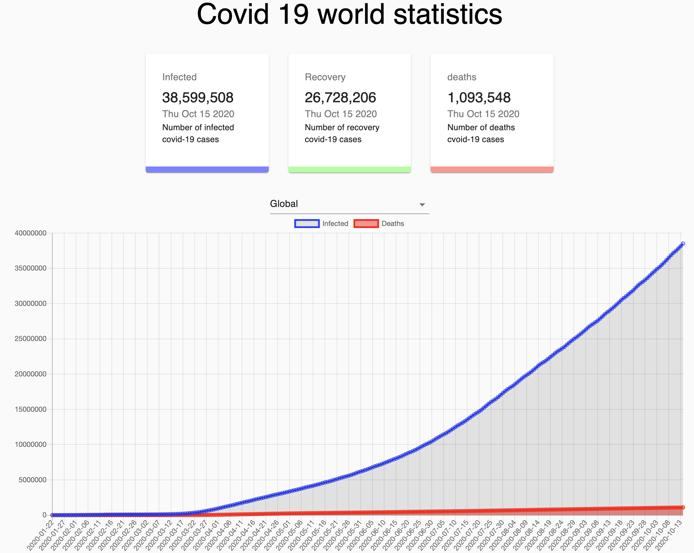

## Covid tracking



Covid tracker build with React. It displays the basic statistics on the number of people that had covid.

https://jixuni.github.io/covid-tracker/

## Getting started

```
Clone or fork the repository
npm or yarn intall the dependecies

```

## Future updates

- Plan to add an interactive map to the application
- Might change up the chart, possibly limit the datapoints on the chart. It gets compress on lower resolution

## Deployment

Its a front end application, its currectly deploy and hosted on github.

## Built with

- [react](https://reactjs.org/) React for the front end display
- [material ui](https://material-ui.com/) For some CSS styling
- [chart.js](https://www.chartjs.org/) For display charts
